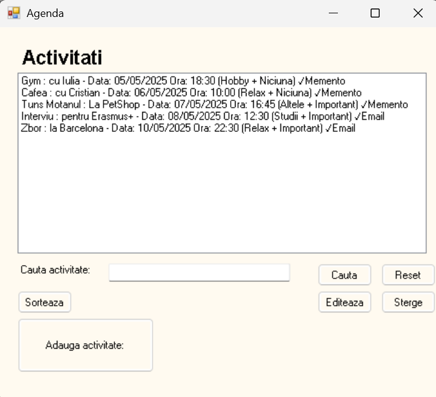
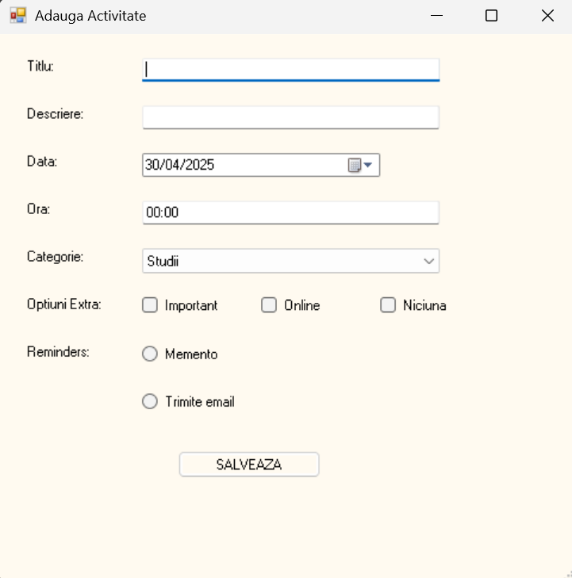

AgendaActivitati este o aplicație Windows Forms scrisă în C#, care permite utilizatorilor să adauge, editeze, șteargă, sorteze și caute activități zilnice, oferind și opțiuni de reminders.
Funcționalități principale:
- Adăugare activități cu titlu, descriere, dată, oră, categorie, opțiuni extra și reminders;
- Editare și ștergere unei activități;
- Căutare activități după titlu sau descriere;
- Sortare activități în funcție de dată și oră;
- Afișare reminder automat pentru activitățile din ziua curentă;
- Persistență a datelor într-un fișier .txt;
- Opțiuni extra (Important, Online) și tipuri de reminder (Memento, Email).

Structura aplicației: 
- Activitate.cs: definește modelul de date pentru o activitate.
- Agenda.cs: gestionează lista de activități și salvarea/încărcarea în fișier.
- FormAgenda.cs: fereastra principală cu listă, căutare, sortare și butoane.
- FormAdaugaActivitate.cs: fereastra pentru adăugare/editare activitate.

 
 
  
